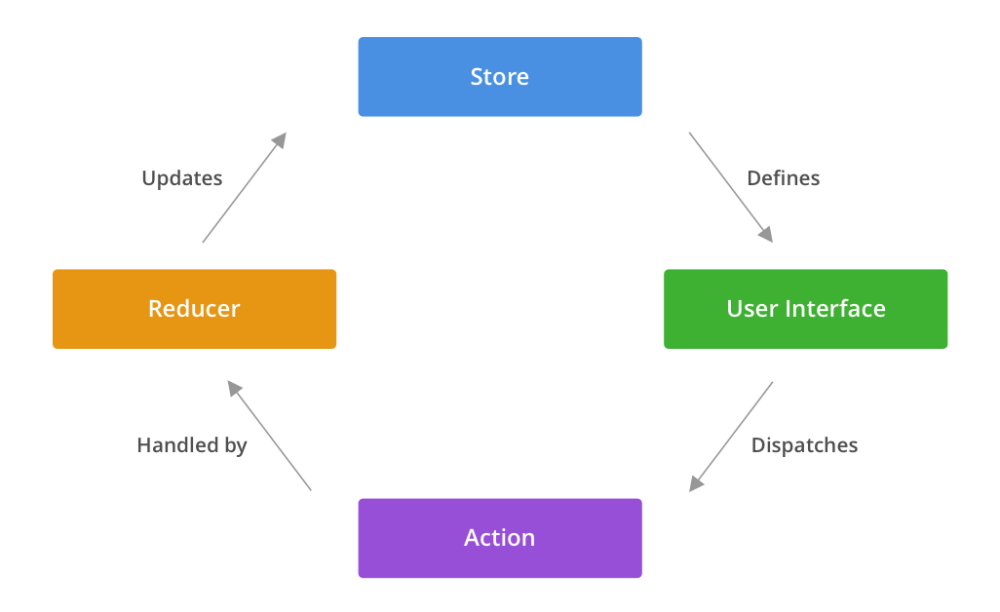

[Build Your Own Redux](https://blog.martindidiego.com/build-your-own-redux/) 포스팅을 보고 직접 실습해 본 예제입니다.

리덕스를 상태관리 라이브러리로 주요하게 사용하면서 내부 구현이 궁금했던 적이 많았습니다. 호기심을 해결해 줄 좋은 글을 읽고 원작자의 허락을 받아 번역 작업도 같이 진행했습니다.
포스팅을 보며 이해한 내용을 바탕으로 직접 리덕스 소스코드를 읽어보았고 추가로 알게 된 내용도 함께 정리해두었습니다.


1. [원본 글(+일부 해석)](#byor-build-your-own-redux)
2. [추가 정리](#개인-정리)


# "BYOR: Build Your Own Redux"

처음 리덕스가 리액트 어플리케이션에서 사용되는 것을 보았을 때, 이게 어떻게 동작되는지 전혀 알 수 없었습니다. 모든 것이 그냥 "연결"되어 있었고 즉시 업데이트 되었습니다. 고차함수가 빈번하게 쓰였고 "액션"과 "타입" 같은 단순한 단어들이 갑자기 중요한 의미를 갖게 되었습니다.

[문서](https://redux.js.org/)를 참조하는 것 외에, 저를 완전히 이해시켜 줬던 것은 이게 어떻게 돌아가는지 직접 시도해 보는 것이었습니다. 이전부터 저는 이것과 같은 복잡한 라이브러리들을 접하고 다른 사람들이 그것들을 "어떻게 사용하는지"가 아닌 "어떻게 동작하는지" 이해하도록 돕곤 했습니다. --그 라이브러리가 가진 컨셉들이 그 라이브러리를 사용하는 것보다 가치있을 때가 있습니다.

이 포스트에서 리덕스의 핵심 로직이 어떻게 동작하는지 알아보고 간단한 음악 플레이어 어플리케이션을 처음부터 만들어 보겠습니다.
다른 모든 리덕스 튜토리얼은 카운터를 만듭니다. 그것들보다 더 재밌을 것이라 약속할 수 있습니다.

[CodeSandbox](https://codesandbox.io/s/eg3lb) 링크입니다.

그리고 완성된 결과입니다:


---

## 리덕스란 무엇일까요?

**노트:** 이미 리덕스가 어떻게 동작하는지 알고 있다면, [시작합니다](#lets-begin) 섹션으로 스킵해도 좋습니다.

> 리덕스는 자바스크립트 앱의 예상 가능한 상태 저장소입니다.

이건 리덕스의 공식적인 소개입니다. 이게 무슨 뜻일까요? 모두 알고 있듯이 리덕스의 본체는 하나의 자바스크립트 객체입니다. 스토어로 불리는 그 객체는 어플리케이션의 상태를 가지고 앱 전반의 상태가 존재할 수 있는 유일한 공간이기도 합니다. `user.isLoggedIn`이나 `shoppingCart.length`처럼 변화가 있을 때에 앱의 다양한 장소에서 그것을 알아야 한다면 그 상태는 스토어에 담길 것입니다. 이 글로벌 객체가 위에서 언급한 "상태 저장소"입니다.

이 상태 저장소가 "예측 가능한" 이유는 앱 전체에 하나의 상태 저장소만 존재하고 그것이 업데이트 되는 방법도 곧 살펴볼 것처럼 하나만 있기 때문입니다. 리덕스는 앱의 다양한 파트가 이 글로벌 상태를 구독하고 변화를 감지하도록 합니다.

## 리덕스는 어떻게 동작할까요?

리덕스는 [구독/발행](https://en.wikipedia.org/wiki/Publish%E2%80%93subscribe_pattern) 패턴을 사용하여 동작합니다. 이 관점에서 구독자는 앱의 글로벌 상태 중 관심 있는 일부 영역을 등록합니다. 이 부분이 변경되면 구독자는 그 변화에 대해 즉시 감지할 수 있습니다.

리액트 어플리케이션의 맥락에선 컴포넌트를 스토어의 구독자로 볼 수 있습니다. 이 컴포넌트들은 스토어와 분리된 컴포넌트와 구분되기 위해 "연결된 컴포넌트(connected components)"로 불립니다. 모든 컴포넌트가 앱의 글로벌 상태에 대해 신경 쓰지는 않는 다는 것을 기억해야 합니다. 최소한의 영역만 연결되도록 보장하는 다양한 방법들이 있고 이를 통해 어플리케이션의 로직을 쉽게 관리할 수 있습니다. 리덕스에서 데이터는 단방향으로 흐르고 스토어를 업데이트하고 전달받기 위한 "하나의 유일한" 방법만 존재합니다.



개념적으로 컴포넌트나 다른 UI의 일부분은 유저가 앱과 상호 작용하거나 이벤트를 발생시킬 때에 액션을 발송합니다. 액션은 하나 또는 그 이상의 리듀서에 의해 처리되며 그 결과로 스토어가 업데이트 됩니다. 이후에 자세히 살펴보겠습니다. 스토어가 새로운 상태로 업데이트 되면, 변화를 추적 중이던 연결된 모든 컴포넌트들은 새로운 상태를 전달받고 필요한 로직을 실행합니다. 이게 가장 기본입니다. 가장 핵심적으로 기억할 것은 단방향의 데이터가 유저 상호작용부터 시작하여 종단에는 UI의 다음 상태를 만든다는 것입니다.

리덕스는 데이터 흐름을 다루는 메서드를 제공하지만 그 흐름을 어떻게 처리할지는 개발자의 구현에 의지합니다.

> 이 플로우의 장점은 UI 상태와 액션이 주어질 때 UI의 다음 상태가 어떻게 결정될지 명확하다는 것입니다. 이 점이 리덕스를 예측 가능하게 만들어줍니다. 

일반적인 리덕스 앱은 이 플로우를 구현합니다. 따라서 이를 깊게 이해하는 것은 리덕스를 사용하는 앱을 매끄럽게 활용하는 데 도움을 줄 것입니다.

---

이제 액션과 리듀서가 어떻게 만들어지는지 간단히 살펴보겠습니다. 스토어는 앱의 상태를 관리하는 글로벌 객체이고 UI는 그 일부분을 구독하는 것을 기억하세요.

### Actions

**액션**은 앱에서 어떤 이벤트나 액션이 일어났는지 설명하는 `type` 필드를 필수적으로 가지는 객체입니다. 각 `type`은 유일해서 리덕스가 액션을 독립적으로 처리할 수 있습니다. 여기 몇 개의 예시가 있습니다:

```js
const ADD_ITEM = { type: "CART.ADD_ITEM" }
const REMOVE_ITEM = { type: "CART.REMOVE_ITEM" }
const LOG_IN_ATTEMPT = { type: "USER.LOG_IN_ATTEMPT" }
const LOG_IN_FAILURE = { type: "USER.LOG_IN_FAILURE" }
```

이게 포스트의 초반에 제가 언급했던 부분입니다; 액션의 컨셉은 실제 구현되는 것보다 더 중요합니다. 액션 자체는 단지 객체입니다.액션의 이름을 짓는 것은 과학보다는 예술에 가깝습니다.

이렇게 생각할 수도 있습니다. "좋습니다. 유저가 상호작용하는 UI가 'CART.ADD_ITEM'이라는 타입을 가진 액션을 발송한다면, 어떤 아이템이 추가될지는 어떻게 특정할 수 있죠?" `type`과 별개로, 각 액션 객체의 구현은 전적으로 자유입니다. 위의 예시에서 액션에 단지 일어난 정보만 담지 않고 어떤 맥락을 추가하여 더 유용하게 만들 수 있습니다. 각 유일한 액션들이 동적인 값들을 담기 위해 액션을 **Action Creator** 함수로 감쌀 것입니다. 함수는 이름에서 예상되는 동작을 수행합니다.

```js
const addItem = itemToAdd => {
  return { type: "CART.ADD_ITEM", item: itemToAdd }
}

const removeItem = itemToRemove => {
  return { type: "CART.REMOVE_ITEM", item: itemToRemove }
}
```

사용하게 될 90%의 액션들은 다양한 정도의 복잡도를 가질 것입니다. 이 때 지키면 좋은 규칙은 액션 생성자를 단순하게 유지하는 것입니다. 나중에 그 규칙을 감사하게 될 것입니다.

### Reducers

이제 액션을 통해 앱에서 발생하는 여러 이벤트를 어떻게 표현할지 알았습니다. 그것들은 리듀서에서 어떻게 "처리"될까요??

**Reducers**는 어플리케이션의 현재 상태와 액션을 받아 액션을 처리한 결과로 생긴 업데이트 된 상태를 반환하는 단순한 함수입니다.
위에서 만든 두 액션을 처리하는 예시를 만들어 보겠습니다.

```js

const initialState = {
  items: [],
}

const CartReducer = (state = initialState, action) => {
  switch (action.type) {
    case: 'ADD_ITEM':
      return {
        ...state,
        items: [...state.items, action.itemToAdd],
      }

    case: 'REMOVE_ITEM':
      return {
        ...state,
        items: state.items.filter(item => item === action.itemToRemove),
      }

    default:
      return state
    }
  }
}

```

위에서처럼 `CartReducer`는 앱의 현재 상태와 액션을 전달 받습니다. 그러고나서 각 액션의 `type`을 보고 업데이트 된 새 상태를 만들어 반환합니다. `state` 인자에 앱의 초기 상태를 전달하는 것을 기억하세요. 나중에 코드를 더 적게 쓸 수 있도록 도와주고 앱이 처음 시작할 때의 대비책을 제공합니다. 한 가지 더 주목할 점은 리듀서가 주어진 액션을 처리할 수 없을 때에 상태를 그대로 반환한다는 것입니다. 이 설계는 액션의 타입을 잘못 입력했을 때에도 앱이 안정적으로 유지될 수 있도록 도와줍니다. 이 경우 가장 최악의 상황에서도 스토어가 업데이트 되지 않는 것에서 그칠 수 있습니다. 

리듀서에서 가장 중요한 부분은 **상태가 절대 변경되지 않는다는 점입니다. 대신 액션을 통해 변화된 상태의 새 복사본을 반환합니다.**.
리덕스는 이 불변성을 강조합니다. 현 상태를 변경하지 않는 것을 통해 앱의 예측 불가능한 부수 효과를 현저히 감소시킬 수 있습니다. 이건 이 주제만으로 포스트를 작성할 가치가 있지만 지금은 리듀서가 스토어의 상태를 절대 수정하지 않는다는 것을 이해하고 넘어가는 것이 가장 중요합니다.

리듀서의 가장 중요한 특징은 액션이 어디서 어떻게 오는지 신경 쓰지 않는다는 것입니다. 리듀서는 단지 액션을 처리하여 다음 상태를 반환할 뿐입니다. 리듀서는 위의 예시 정도로 단순하거나 혹은 조금 더 복잡하지만 그 핵심은 변하지 않습니다. [문서](https://redux.js.org/basics/reducers)는 더 알면 좋을 몇 가지 고급 예시들을 제공합니다.

---

이제 액션과 리듀서, 스토어가 어떻게 동작하는지 이해했으니 리덕스의 3가지 중요한 원칙을 이해하기 더 쉬울 것입니다.

1. **Single Source of Truth**: 스토어는 앱 전체의 상태를 가지고 있습니다
2. **State is Read-Only**: 상태는 절대 직접 변경될 수 없고 발송된 액션과 리듀서를 거쳐야 합니다
3. **Changes Are Made With Pure Functions**: 리듀서는 항상 새로운 상태 객체를 반환해야 합니다

## Let's Begin

리덕스의 API가 제공하는 것은 많지 않습니다. 리덕스 앱에서 대부분의 코드는 스스로 작성해야합니다. 리덕스는 5개의 메서드를 제공하고 그 중 4개를 직접 구현해보겠습니다:

- `createStore(reducer)`
- `combineReducers(reducers)`
- `applyMiddleware(middleware)`
- `bindActionCreators(actionCreators, dispatch)`

`compose(...functions)` 메서드는 의도적으로 생략하려고 하는데 이번 실습에 크게 중요하지 않기 때문입니다. 따라서 `applyMiddleware`는 공식적인 리덕스 API가 `...middleware`를 받는 것과 다르게 하나의 미들웨어 함수만 받을 것입니다. 

[API Reference](https://redux.js.org/api/api-reference)를 스펙으로 사용할 것이므로 리덕스 [소스코드](https://github.com/reduxjs/redux)나 문서를 참고할 때 변수명에서 친숙함을 느낄 수 있을 것입니다.

### createStore

이 메서드는 앱의 상태를 저장하는 리덕스 스토어를 생성합니다. 이 스토어는 구독, 액션의 발송, 현재 상태 반환 메서드를 제공합니다.

```js
/**
 * Creates a Redux store which will hold all our application
 * state.
 */
export const createStore = reducer => {
  /**
   * This is where our global application state
   * will live.
   *
   * Notice the use of `let` here -- we won't ever
   * be mutating the state directly but instead
   * replacing it with the next state each time.
   */
  let state

  /**
   * This will hold a list of referneces to listener
   * functions that we'll fire when the state changes.
   *
   * Any time a part of our UI subscribes to our store,
   * we'll add that to this list.
   */
  const listeners = []

  /**
   * Returns the current state of the Store.
   */
  const getState = () => state

  /**
   * Dispatches an action to trigger a state change
   * and then invokes all listeners.
   */
  const dispatch = action => {
    state = reducer(state, action)
    listeners.forEach(listener => listener())

    /**
     * We return the Action so that we can chain Actions
     * in other parts of our application.
     */
    return action
  }

  /**
   * Add a subscription to our list of listeners.
   */
  const subscribe = listener => {
    listeners.push(listener)

    /**
     * Return an unsubscribe function to allow consumers
     * to remove the given listener.
     */
    return function unsubscribe() {
      const idx = listeners.indexOf(listener)
      listeners.splice(idx, 1)
    }
  }

  return { getState, dispatch, subscribe }
}
```

위에 보이듯이 스토어는 특별하지 않습니다. 리듀서를 받아서 매번 리듀서가 처리한 액션의 결과로 재할당 되는 객체를 가지고 있을 뿐입니다. 스토어는 `listeners` 배열의 모든 구독을 추적하고 `dispatch`를 통해 액션이 발송되었을 때 각 리스너를 실행합니다. `getState` 메서드는 UI가 필요할 때 언제든지 글로벌 앱 상태에 접근할 수 있도록 해줍니다.

`subscribe` 메서드는 리덕스의 구독자가 특정 시점부터 스토어의 구독을 취소할 수 있도록 unsubscribe 메서드를 반환합니다. 구독 취소는 퍼포먼스가 중요한 앱이나 스토어에 구독 중인 요소가 많을 경우 필수적입니다.

기술적으로 구독자가 스토어를 사용하기 위해 제공해야 하는 메서드는 이게 전부이지만 리덕스는 아래에 직접 구현해 볼 몇 가지 유틸리티 메서드를 제공합니다.

### combineReducers

이 메서드는 리덕스에서 가장 자주 쓰이는 유틸리티 메서드 중 하나입니다. 이름이 그 역할을 잘 대변해주기 때문에 저는 이 이름이 굉장히 좋습니다.

앱의 복잡도가 증가할수록, 앱의 상태를 하나의 리듀서가 맡는 것을 유지하기 어렵다는 것을 알게 될 것입니다. 대신 대부분의 개발자들은 일부분의 상태마다 개별적인 리듀서를 만들고 그것들을 하나로 합해 하나의 리듀서로 만들고 `createStore`에 넣습니다.

`combineReducers`의 인자는 다음과 같을 것입니다:

```js
const appReducer = combineReducer({ user: userReducer, cart: cartReducer })
```

제공된 `user`와 `cart` 키는 리덕스가 각 리듀서마다 네임스페이스를 가져 액션 타입의 이름에 따른 충돌이 발생하는 것을 피하게 해줍니다. 다음과 같이 만들어 볼 수 있습니다:

```js
/**
 * Combines multiple reducers that deal with individual
 * slices of state into one big app reducer.
 *
 * This composed reducer is typically what is fed into
 * `createStore`.
 */
export const combineReducers = reducers => {
  const reducerKeys = Object.keys(reducers)
  function combinedReducer(state = {}, action) {
    const nextState = {}
    reducerKeys.forEach(key => {
      nextState[key] = reducers[key](state[key], action)
    })
    return nextState
  }

  return combinedReducer
}
```

위에서 볼 수 있듯이, `combineReducers` 메서드는 매개변수에서 키를 가져와 하나의 통합된 리듀서로 만들어주는 `combinedReducer` 함수를 반환합니다. 이 통합된 리듀서는 일반적인 리듀서와 같이 다음 상태를 반환하지만 상태에 네임스페이스가 존재합니다. 예시를 통해 더 명확히 해봅시다.

앱의 글로벌 상태 중 분리된 두 부분을 다루는 두 개의 리듀서를 만들겠습니다.

```js
const initialState = {
  profile: {},
  loggedIn: false,
  lastUpdated: null
}

const userReducer = (state = initialState, action) => {
  switch (action.type) {
    case "LOG_IN":
      return {
        ...state,
        profile: action.profile
        loggedIn: true,
        lastUpdated: Date.now()
      }

    case "LOG_OUT":
      return {
        ...state,
        profile: {},
        loggedIn: false,
        lastUpdated: Date.now()
      }

    default:
      return state
  }
}
```

```js
const initialState = {
  items: [],
  lastUpdated: null
}

const cartReducer = (state = initialState, action) => {
  switch (action.type) {
  case: 'ADD_ITEM':
    return {
      ...state,
      items: [...state.items, action.itemToAdd],
      lastUpdated: Date.now()
    }

  case: 'REMOVE_ITEM':
    return {
      ...state,
      items: state.items.filter(item => item === action.itemToRemove),
      lastUpdated: Date.now()
    }

  default:
    return state
  }
}
```

이제 두 리듀서를 `appReducer`라는 하나의 큰 리듀서로 통합해 봅시다. 어떻게 각 리듀서의 상태에서 `lastUpdated` 필드를 가질 수 있는지 주목해주세요. `combinedReducers` 함수는 이름이 겹쳐 충돌하는 것이 문제되지 않습니다.

```js
import { createStore, combineReducers } from "redux"

const appReducer = combineReducers({
  user: userReducer,
  cart: cartReducer,
})

const store = createStore(appReducer)
```

이제 통합된 상태는 다음과 같을 것입니다:

```js
const state = {
  user: {
    profile: {},
    loggedIn: false,
    lastUpdated: null,
  },
  cart: {
    items: [],
    lastUpdated: null,
  },
}
```

매 액션이 발송될 때마다 리덕스는 통합된 리듀서를 통해 액션을 처리하고 그 중 관련된 상태만이 업데이트 될 것입니다. 아마 느껴지실테지만 이 방식은 매우 복잡한 상태 객체를 가지거나 여러개의 분리된 상태가 앱 내에 존재할 때 매우 유용합니다. 하나의 독립된 리듀서에 대해 작업하고 상관없는 영역에는 영향이 없음을 아는 것은 리덕스의 장점 중 하나입니다. 

### applyMiddleware

[How Does Redux Work?](#how-does-redux-work) 섹션에서, 간단히 리덕스의 데이터 흐름에 대해 살펴봤습니다. 거기서 액션이 바로 리듀서로 발송되는 것을 확인했을 것입니다. 리덕스에서 미들웨어는 스토어의 `dispatch` 메서드를 감싸 발송된 액션을 가져오고 원하는 동작을 할 수 있게 해줍니다. 미들웨어 함수는 일반적으로 다음과 같습니다:

```js
const loggerMiddleware = store => next => action => {
  console.log("About to dispatch", action)
  const nextValue = next(action)
  console.log("Action processed. Next state:", store.getState())
  return nextValue
}
```

리덕스 미들웨어의 문법은 처음 봤을 때 이해하기 어렵습니다. 함수가 함수를 반환하고 그 함수가 다시 함수를 반환하는 형태입니다. 이 복잡함에는 이유가 있습니다.

첫 번째 함수는 리덕스의 `store`를 유일한 매개변수로 받아 `store` 컨텍스트가 이미 설정된 커리된 함수를 반환합니다. 이어지는 함수는 `next` 함수를 유일한 매개변수로 받고 발송된 다음 액션을 처리하게 해줍니다. 마지막 함수는 발송된 원래의 `action`을 매개변수로 받습니다. 이 함수 시그니처는 우수한 통합성을 제공하기 때문에 리덕스 창시자가 선택했습니다. 커링에 대해 더 알아보고 싶다면 [이 글을 읽어보세요](https://blog.bitsrc.io/understanding-currying-in-javascript-ceb2188c339).

미들웨어를 이해하는 좋은 방법은 다른 액션을 감싸는 함수로 생각하는 것입니다. 위의 경우에 미들웨어는 단순히 어떤 일이 일어날지 로깅해주고 `next(action)`을 호출하여 데이터 흐름을 진행합니다. `next` 함수가 이 부분 중 가장 중요한 역할을 합니다. 비동기 이벤트를 포함한 원하는 모든 다음 액션을 처리할 수 있습니다.

이 함수를 우리 나름대로 다시 쓴다면 다음과 같을 것입니다:
```js
/**
 * Wraps `dispatch` functions with the provided middleware
 * function.
 */
export const applyMiddleware = middleware => {
  return createStore => reducer => {
    const store = createStore(reducer)
    return {
      ...store,
      dispatch: function dispatch(action) {
        return middleware(store)(store.dispatch)(action)
      },
    }
  }
}
```

이 함수는 미들웨어가 추가된 "enhanced store"를 반환합니다. 새로 반환된 스토어에서 모든 메서드 중 `dispatch` 메서드만 미들웨어가 적용된 형태로 재작성 된 것을 주목해주세요. 함수는 다음과 같이 사용될 것입니다:

```js
import { createStore, applyMiddleware } from "redux"
import appReducer from "./reducers"

const logger = store => next => action => {
  console.log("About to dispatch", action)
  const nextValue = next(action)
  console.log("Action processed. Next state:", store.getState())
  return nextValue
}

const enhancedStore = applyMiddleware(logger, createStore, appReducer)
```

비동기 작업이 포함된 큰 리덕스 앱을 만든다면 (글을 쓰는 기준으로) 월에 6백만 다운로드가 이루어진 라이브러리인 `redux-thunk`를 사용해봤을 것입니다. `redux-thunk`는 미들웨어의 예시 중 하나입니다. 사실 [이 코드는 14줄에 불과하기 때문에](https://github.com/reduxjs/redux-thunk/blob/master/src/index.js) 리덕스가 미들웨어를 어떻게 다루는지 더 관심이 있다면 한번쯤 읽어보기를 추천합니다.

### bindActionCreators

마지막이면서 역시 중요한 `bindActionCreators`가 있습니다. 일반적으로 액션 생성자를 발송하기 위한 형태는 다음과 같습니다:

```js
store.dispatch(userActions.logIn(profile))
store.dispatch(userActions.logOut())
store.dispatch(cartActions.addItem(item))
// ...
```

`createStore`에서 반환하는 스토어 객체는 스토어의 상태를 변화시키는 액션을 다루기 위한 `dispatch` 메서드를 가지고 있다는 점을 기억해야 합니다. 이때문에 상태를 업데이트하기 위해서는 `store.dispatch()` 메서드를 매번 호출해야 합니다. 앱에는 하나의 스토어만 존재하고 그 컨텍스트 내에서 실행되기 대문에 매번 메서드를 호출하는 것은 오버헤드를 만듭니다.

리덕스의 `bindActionCreators`는 액션 생성자에 주어진 스토어의 `dispatch` 메서드를 감싼 형태를 제공합니다. 꽤 단순한 함수이지만 장기적으로 시간을 절약하는 데에 큰 도움을 줍니다. 다음과 같은 방식으로 구현할 수 있습니다:

```js
/**
 * Wraps Action Creators in `dispatch` calls for the consumer so
 * that they don't have to call `store.dispatch(ActionCreator.something())`
 * each time.
 */
export const bindActionCreators = (actionCreators, dispatch) => {
  const boundedActionCreators = {}
  const actionKeys = Object.keys(actionCreators)
  actionKeys.forEach(key => {
    const actionCreator = actionCreators[key]
    boundedActionCreators[key] = function boundedActionCreator() {
      return dispatch(actionCreator.apply(this, arguments))
    }
  })
  return boundedActionCreators
}
```

이 구현에서 `actionCreators`의 각 액션 생성자를 순회하며 `dispatch`가 항상 함께 호출될 수 있도록 새로운 형태로 만들어 주었습니다. 마지막으로 액션 생성자와 메서드가 연결된 버전을 반환하여 다음과 같이 사용할 수 있습니다:

```js
import { bindActionCreators } from "redux"
import { userActions, cartActions } from "./actions"
import store from "./store"

const boundedUserActions = bindActionCreators(userActions, store.dispatch)

const boundedCartActions = bindActionCreators(cartActions, store.dispatch)

// Dispatching Actions
boundedUserActions.logIn(profile)
boundedUserActions.logOut()
boundedCartActions.addItem(item)
```

## Building a Music Player

Now that we've built our core Redux functions, let's create a simple application that uses them. Our app will store a list of songs, show the currently playing song, and also allow the user to go forwards and backwards through the available songs.

Our app's file structure will look like this:

```
app
│   index.html
│   redux.js
│
└───src
│   │   index.js
│   │   redux.js
│   │   songs.json
│   │   songActions.js
│   │   songReducer.js
│   │   styles.css
```

Each file is sort of self explanatory. `src/index.js` will hold our app's logic. `redux.js` will house our implementation of Redux. `songs.json` is our hardcoded list of songs. `songActions.js` and `songReducer.js` will store the Action Creators and Reducer for our app's state, respectively.

Using what we've created in the previous section, our final `redux.js` should look like this:

```js
/**
 * Creates a Redux store which will hold all our application
 * state.
 */
export const createStore = reducer => {
  /**
   * This is where our global application state
   * will live.
   *
   * Notice the use of `let` here -- we won't ever
   * be mutating the state directly but instead
   * replacing it with the next state each time.
   */
  let state

  /**
   * This will hold a list of referneces to listener
   * functions that we'll fire when the state changes.
   *
   * Any time a part of our UI subscribes to our store,
   * we'll add that to this list.
   */
  const listeners = []

  /**
   * Returns the current state of the Store.
   */
  const getState = () => state

  /**
   * Dispatches an action to trigger a state change
   * and then invokes all listeners.
   */
  const dispatch = action => {
    state = reducer(state, action)
    listeners.forEach(listener => listener())

    /**
     * We return the Action so that we can chain Actions
     * in other parts of our application.
     */
    return action
  }

  /**
   * Add a subscription to our list of listeners.
   */
  const subscribe = listener => {
    listeners.push(listener)

    /**
     * Return an unsubscribe function to allow consumers
     * to remove the given listener.
     */
    return function unsubscribe() {
      const idx = listeners.indexOf(listener)
      listeners.splice(idx, 1)
    }
  }

  return { getState, dispatch, subscribe }
}

/**
 * Combines multiple reducers that deal with individual
 * slices of state into one big app reducer.
 *
 * This composed reducer is typically what is fed into
 * `createStore`.
 */
export const combineReducers = reducers => {
  const reducerKeys = Object.keys(reducers)
  function combinedReducer(state = {}, action) {
    const nextState = {}
    reducerKeys.forEach(key => {
      nextState[key] = reducers[key](state[key], action)
    })
    return nextState
  }

  return combinedReducer
}

/**
 * Wraps `dispatch` functions with the provided middleware
 * functions. Notice the curried functions.
 */
export const applyMiddleware = (...middlewares) => {
  return createStore => reducer => {
    const store = createStore(reducer)
    return {
      ...store,
      dispatch: function dispatch(action) {
        /**
         * Replace `store.dispatch` with `next` if you need to
         * support composed middlewares.
         */
        return middlewares(store)(store.dispatch)(action)
      },
    }
  }
}

/**
 * Wraps Action Creators in `dispatch` calls for the consumer so
 * that they don't have to call `store.dispatch(ActionCreator.something())`
 * each time.
 */
export const bindActionCreators = (actionCreators, dispatch) => {
  const boundedActionCreators = {}
  const actionKeys = Object.keys(actionCreators)
  actionKeys.forEach(key => {
    const actionCreator = actionCreators[key]
    boundedActionCreators[key] = function boundedActionCreator() {
      return dispatch(actionCreator.apply(this, arguments))
    }
  })
  return boundedActionCreators
}
```

Let's create the markup for our basic music player in our `index.html` file.

```html
<!DOCTYPE html>
<html>
  <head>
    <title>Build Your Own Redux</title>
    <meta charset="UTF-8" />
    <link
      rel="stylesheet"
      href="https://stackpath.bootstrapcdn.com/font-awesome/4.7.0/css/font-awesome.min.css"
    />
    <link rel="stylesheet" href="./src/styles.css" />
  </head>
  <body>
    <h1>Redux Player</h1>
    <div class="player-wrapper">
      <div class="player-controls">
        <i id="prevIcon" class="fa fa-backward" aria-hidden="true"></i>
        <i id="playPauseIcon" class="fa fa-play"></i>
        <i id="nextIcon" class="fa fa-forward" aria-hidden="true"></i>
      </div>
      <span id="activeSong">Select A Song</span>
    </div>
    <ul class="song-list"></ul>
  </body>
</html>
```

We've specifically given a few elements ids so that we can update their content once we connect them to Redux. Our `src/styles.css` would look like this:

```css
body {
  font-family: Roboto, Oxygen, Ubuntu, Cantarell, "Open Sans", "Helvetica Neue",
    sans-serif;
  max-width: 450px;
  display: flex;
  flex-direction: column;
  margin: 0 auto;
  background-color: #ffffff;
  background-image: url("data:image/svg+xml,%3Csvg width='52' height='26' viewBox='0 0 52 26' xmlns='http://www.w3.org/2000/svg'%3E%3Cg fill='none' fill-rule='evenodd'%3E%3Cg fill='%23cacaca' fill-opacity='0.25'%3E%3Cpath d='M10 10c0-2.21-1.79-4-4-4-3.314 0-6-2.686-6-6h2c0 2.21 1.79 4 4 4 3.314 0 6 2.686 6 6 0 2.21 1.79 4 4 4 3.314 0 6 2.686 6 6 0 2.21 1.79 4 4 4v2c-3.314 0-6-2.686-6-6 0-2.21-1.79-4-4-4-3.314 0-6-2.686-6-6zm25.464-1.95l8.486 8.486-1.414 1.414-8.486-8.486 1.414-1.414z' /%3E%3C/g%3E%3C/g%3E%3C/svg%3E");
  margin-top: 50px;
}

#activeSong {
  display: inline-block;
  padding-left: 100%;
  white-space: nowrap;
  animation: marquee 4s linear infinite;
}

.disclaimer {
  font-size: 11px;
  color: gray;
  margin: 5px auto;
}

.player-wrapper {
  background: #232323;
  color: white;
  margin-bottom: 10px;
  border-radius: 4px;
  padding: 25px;
  display: flex;
  flex-direction: column;
  align-items: center;
}
.player-controls {
  display: flex;
  align-items: center;
  margin-bottom: 5px;
}
.player-controls i {
  margin: 0px 10px 10px 10px;
  cursor: pointer;
}

.song-list {
  list-style-type: none;
  margin: 0;
  padding: 0;
}
.song-item {
  box-shadow: 0px 0px 4px rgba(136, 136, 136, 0.5);
  background-color: white;
  border-radius: 4px;
  padding: 15px;
  display: flex;
  align-items: center;
  transition: all 0.2s ease-out;
  cursor: pointer;
  margin-bottom: 10px;
  border-left: 5px solid transparent;
}
.song-item.active {
  border-left: 5px solid #3179e4;
}
.song-item:hover {
  background-color: rgba(249, 249, 249, 0.97);
}
.song-controls {
  margin-right: 16px;
}

.song-content-artist {
  display: block;
  margin-top: 8px;
  color: gray;
  font-size: 13px;
}

@keyframes marquee {
  0% {
    transform: translate(0, 0);
  }
  100% {
    transform: translate(-100%, 0);
  }
}
```

Our `src/songs.json` looks like this. You could change the names of the songs, but that would really hurt.

```json
[
  {
    "title": "Lights Out, Words Gone",
    "artist": "Bombay Bicycle Club"
  },
  { "title": "Alter Ego", "artist": "Tame Impala" },
  { "title": "A Forest", "artist": "The Cure" },
  { "title": "Glorious Warrior", "artist": "Electric Guest" },
  { "title": "Tape Machine", "artist": "STRFKR" }
]
```

---

Okay, enough setup. Let's start using our Redux implementation. Before diving deep in Reducers and Actions, I usually take a few minutes to think about what our state will look like.

```js
const initialState = {
  isPlaying: false,
  activeSong: null,
  songs: [],
}
```

Not the most complex state in the world, but it's enough to power our simple app. Next, we'll jump into our `src/songActions.js` file by creating some Action Creators for our song Reducer which we'll write next.

```js
const loadSongs = songs => ({ type: "LOAD_SONGS", songs })
const playSong = song => ({ type: "PLAY_SONG", song })
const togglePlay = () => ({ type: "TOGGLE_PLAY" })
const playNext = () => ({ type: "PLAY_NEXT" })
const playPrev = () => ({ type: "PLAY_PREV" })

export default { loadSongs, playSong, togglePlay, playNext, playPrev }
```

And our `src/songReducer.js`:

```js
/**
 * Our app's initial state.
 */
const initialState = {
  isPlaying: false,
  activeSong: null,
  songs: [],
}

/**
 * Reducer for our 'Song' slice of state.
 */
const songReducer = (state = initialState, action) => {
  const actionMap = {
    LOAD_SONGS: () => ({
      ...state,
      songs: action.songs,
    }),
    PLAY_SONG: () => ({
      ...state,
      isPlaying: true,
      activeSong: action.song,
    }),
    TOGGLE_PLAY: () => ({
      ...state,
      isPlaying: !state.isPlaying,
    }),
    PLAY_NEXT: () => {
      if (!state.activeSong) {
        return {
          ...state,
          isPlaying: true,
          activeSong: state.songs[0],
        }
      }
      const activeSongIndex = state.songs.indexOf(state.activeSong)
      const nextSong = state.songs[(activeSongIndex + 1) % state.songs.length]
      return {
        ...state,
        isPlaying: true,
        activeSong: nextSong,
      }
    },
    PLAY_PREV: () => {
      if (!state.activeSong) {
        return {
          ...state,
          isPlaying: true,
          activeSong: state.songs[0],
        }
      }
      const activeSongIndex = state.songs.indexOf(state.activeSong)
      const prevSong = state.songs[(activeSongIndex - 1) % state.songs.length]
      return {
        ...state,
        isPlaying: true,
        activeSong: prevSong,
      }
    },
  }

  // highlight-next-line
  return actionMap[action.type]() || state
}

export default songReducer
```

Our song Reducer handles the provided Action types we just created and updates the state accordingly. In this particular case, I chose to make the Action handlers a map with a corresponding function and invoke them as shown in the highlighted line above. This is purely stylistic -- I just prefer how this looks to switch/case statements but the end result is the same.

Our `PLAY_NEXT` and `PLAY_PREV` handlers also gracefully handle going out of bounds of our `state.songs` array by circling back to the beginning as a normal music player would.

We now have our styles, markup, Reducer, Action Creators, and song data. All that's left is connecting everything to make our UI shine.

---

We'll start in our `src/index.js` by importing our own Redux functions, creating our Store, and storing references to our DOM for easy updates later on.

```js
// Import our newest creation...
import { createStore } from "./redux"

// Stuff for Redux.
import songs from "./songs"
import songReducer from "./songReducer"
import songActions from "./songActions"

/**
 * Collection of DOM element references to save us time.
 */
const elements = {
  player: {
    activeSong: document.getElementById("activeSong"),
    playPauseIcon: document.getElementById("playPauseIcon"),
    nextIcon: document.getElementById("nextIcon"),
    prevIcon: document.getElementById("prevIcon"),
  },
  songList: document.querySelector(".song-list"),
}

/**
 * Create our application Store -- the single source of truth
 * for app state.
 */
const store = createStore(songReducer)
```

At this point, if we `console.log()` our `store` reference, we should see the methods we created on it:


Next, let's link our `src/index.js` to our `index.html` file so we can use it.

```html
<head>
  <title>Build Your Own Redux</title>
  <meta charset="UTF-8" />
  <link
    rel="stylesheet"
    href="https://stackpath.bootstrapcdn.com/font-awesome/4.7.0/css/font-awesome.min.css"
  />
  // highlight-next-line
  <script src="src/index.js"></script>
</head>
```

Now we can create a subscription to our Store for the player.

```js
/**
 * Create a listener for the player's state and handle the UI
 * updates.
 */
store.subscribe(() => {
  const { activeSong, isPlaying } = store.getState()
  if (activeSong) {
    elements.player.activeSong.innerHTML = `${activeSong.title} - ${
      activeSong.artist
    }`
  }
  if (isPlaying) {
    elements.player.playPauseIcon.classList.add("fa-pause")
  } else {
    elements.player.playPauseIcon.classList.remove("fa-pause")
  }
})
```

This listener function gets added into our Store's 'listeners' array which will be called each time the state updates. In our case above, we simply deconstruct the parts of state that we care about and update our UI accordingly. At this point, our UI is connected and listening, but we don't have a way to update our state's `isPlaying` or `activeSong` field yet so our player should still say 'Select A Song'.


Let's bind our Action Creators to our Store's `dispatch` function so we can begin loading data into our state.

```js
import { createStore, bindActionCreators } from "./redux"

// ...

/**
 * Bind our Action Creators to our `dispatch` function so we
 * don't have to call `store.dispatch()` each time.
 */
const boundedActions = bindActionCreators(songActions, store.dispatch)

/**
 * Initialize our Store's state by loading all our songs.
 */
boundedActions.loadSongs(songs)
```

If we `console.log(store.getState())` we should see our songs loaded which means our `createStore` and `dispatch` functions are working as intended.


Now that our source of truth holds our list of songs, let's connect our UI to the store and render a list.

```js
/**
 * Create a song item element for each song in our global state.
 * Each song element will also have a click handler which will
 * dispatch an action to play the given song.
 */
const renderSongList = (songs, activeSong, isPlaying, actions) => {
  const fragment = document.createDocumentFragment()

  /**
   * Note: this is a really inefficient way of updating the DOM, but
   * that's outside the scope of this tutorial. For now, we just need
   * a way to refresh our `<ul>` song list DOM node with the latest
   * correct data.
   */
  while (elements.songList.firstChild) {
    elements.songList.removeChild(elements.songList.firstChild)
  }
  songs.forEach(song => {
    const li = document.createElement("li")
    const isActiveSong =
      isPlaying && activeSong && activeSong.title === song.title
    li.innerHTML = `
      <div class="song-item ${isActiveSong ? "active" : ""}">
        <div class="song-controls">
          <i class="fa ${isActiveSong ? "fa-pause" : "fa-play"}"></i>
        </div>
        <div class="song-content">
          <span>${song.title}</span>
          <span class="song-content-artist">${song.artist}</span>
        </div>
      </div>
    `
    li.addEventListener("click", () => {
      if (isActiveSong) {
        actions.togglePlay()
        return
      }
      actions.playSong(song)
    })
    fragment.appendChild(li)
  })
  elements.songList.appendChild(fragment)
}

/**
 * Create a listener for the full list of songs available so that we
 * can keep the list up to date.
 */
store.subscribe(() => {
  const { songs, activeSong, isPlaying } = store.getState()
  renderSongList(songs, activeSong, isPlaying, boundedActions)
})
```

Just like our first subscription, we've hooked into our Store's state and deconstructed the parts that we care about. For readability, I split `renderSongList` into its own function. This function updates our DOM to make sure our `ul.song-list` element always represents the latest data from our store. Since we're not using a UI rendering library, we had to go old school and manually remove/add child nodes to our DOM. Here, we map over our `songs` array and, for each `song`, we create a new `<li>` element to insert into the DOM while also adding a click handler for it. The click handler dispatches `playSong()` and `togglePlay()` when appropriate.

**Note:** It's important that we _first_ call `boundedActions.loadSongs()` before adding our subscriptions. Dispatching any action will trigger our subscription listener functions and if we create the subscription _after_ we dispatch, they'll miss handling the first time our Store updates.

At this point, your song list should be rendered and you should be able to click on any track to make it the `activeSong`. All that's left is connecting our player's backwards, forwards, and play/pause buttons to update the state, which we can do as shown:

```js
/**
 * Bind Action dispatchers to the player's control elements.
 */
elements.player.nextIcon.addEventListener("click", () => {
  boundedActions.playNext()
})
elements.player.prevIcon.addEventListener("click", () => {
  boundedActions.playPrev()
})
elements.player.playPauseIcon.addEventListener("click", () =>
  boundedActions.togglePlay()
)
```

And that's it! You should now have a fully connected UI that updates the app's state using our own implementation of Redux. :)

---

Like any complex library, Redux is grounded on certain principles which guide its logic flow and ultimately its API. What I hope to convey with this post is that most of Redux's best practices are left to the developer to implement and that's why it's crucial to understand why it works the way it does. I big ah-ha moment for me in my career was when I stopped blindly following documentation and took the time to understand why and how the library in question functions.

I hope not just that you have a better understanding of Redux, but that you can abstract what you've learned from this post and apply it to your own library.

Thanks for reading and happy state management!


# 개인 정리

블로그의 포스팅을 읽으면서 리덕스의 기본적인 구성에 대해 이해할 수 있었습니다.
리덕스 소스코드를 읽으면서 더 알아보고자 생각한 부분은 미들웨어를 적용하는 방법이었습니다.

포스팅에는 미들웨어가 하나 존재하는 것으로 가정하기도 했고, 미들웨어를 구현 상에서 사용하지 않았기 때문에 이 부분을 더 깊게 알고 싶었습니다.

```ts
this.store = createStore(
    rootReducer,
    applyMiddleware(
      redux-logger,
      sagaMiddleware,
    ),
  )
```

미들웨어는 보통 위와 같이 `createStore` 메서드의 두 번째 인자로 들어갑니다. 

```ts
export default function createStore<
  S,
  A extends Action,
  Ext = {},
  StateExt = never
>(
  reducer: Reducer<S, A>,
  enhancer?: StoreEnhancer<Ext, StateExt>
): Store<ExtendState<S, StateExt>, A, StateExt, Ext> & Ext
```

`createStore`의 함수 시그니처는 위와 같습니다. `applyMiddleware` 함수는 `enhancer`의 역할을 합니다.

```ts
if (typeof enhancer !== 'undefined') {
  if (typeof enhancer !== 'function') {
    throw new Error(
      `Expected the enhancer to be a function. Instead, received: '${kindOf(
        enhancer
      )}'`
    )
  }

  return enhancer(createStore)(
    reducer,
    preloadedState as PreloadedState<S>
  ) as Store<ExtendState<S, StateExt>, A, StateExt, Ext> & Ext
}
```

`createStore` 메서드의 일부를 가져왔습니다. `enhancer`가 존재할 경우 `enhancer(createStore)(reducer)`의 형태로 반환되는 것을 알 수 있습니다. 

이것을 인지한 상태로 `applyMiddleware` 함수를 찾아보았습니다.

```ts
export default function applyMiddleware(
  ...middlewares: Middleware[]
): StoreEnhancer<any> {
  return (createStore: StoreEnhancerStoreCreator) =>
    <S, A extends AnyAction>(
      reducer: Reducer<S, A>,
      preloadedState?: PreloadedState<S>
    ) => {
      const store = createStore(reducer, preloadedState)
      let dispatch: Dispatch = () => {
        throw new Error(
          'Dispatching while constructing your middleware is not allowed. ' +
            'Other middleware would not be applied to this dispatch.'
        )
      }

      const middlewareAPI: MiddlewareAPI = {
        getState: store.getState,
        dispatch: (action, ...args) => dispatch(action, ...args)
      }
      const chain = middlewares.map(middleware => middleware(middlewareAPI))
      dispatch = compose<typeof dispatch>(...chain)(store.dispatch)

      return {
        ...store,
        dispatch
      }
    }
}
```

`applyMiddleware` 함수를 호출했을 때 반환되는 함수 시그니처는 `(createStore) => (reducer) => {store, dispatch}` 입니다. 

위의 포스팅 내용과 소스코드에서 본 내용을 조합하여 `applyMiddleware` 함수는 기존의 `store`에서 `dispatch` 메서드를 변화시키는 역할을 하고있음을 알 수 있었습니다.

`middleware`는 `({get, dispatch}) => next => action => any`의 시그니처를 가지고 있습니다. 

1106번째 라인에서 `middlewareAPI`가 생성되어 각 `middleware`에 전달됩니다.
그 후 1111번째 라인에서 `compose` 메서드가 적용된 결과값에 `store.dispatch`가 전달됩니다. 이렇게 변경된 `dispatch`가 최종적으로 반환되는데요.
`compose` 함수부터 좀 더 알아보았습니다.

```ts
/**
 * Composes single-argument functions from right to left. The rightmost
 * function can take multiple arguments as it provides the signature for the
 * resulting composite function.
 *
 * @param funcs The functions to compose.
 * @returns A function obtained by composing the argument functions from right
 *   to left. For example, `compose(f, g, h)` is identical to doing
 *   `(...args) => f(g(h(...args)))`.
 */
 export default function compose(...funcs: Function[]) {
  if (funcs.length === 0) {
    // infer the argument type so it is usable in inference down the line
    return <T>(arg: T) => arg
  }

  if (funcs.length === 1) {
    return funcs[0]
  }

  return funcs.reduce(
    (a, b) =>
      (...args: any) =>
        a(b(...args))
  )
}
```

`compose` 함수는 DOCS에 적힌 설명처럼 단일 매개변수를 갖는 함수들을 합치는 역할을 해준다.
`(...args) => f(g(h(...args)))` 예시를 보는게 이해하기 편했다.

`compose` 함수의 인자로 `chain` 변수가 들어가고 그 반환값에 `store.dispatch`를 넣는 구조는 처음 봤을 때에는 이해하기 어려웠다.

내가 이해한 방식은 다음과 같다. `middlewareAPI`가 적용된 후인 `next => action => any` 시그니처에 대해 생각했다.
`store.dispatch`를 인자로 받게되면 `compose` 된 `chanin`에서
마지막 미들웨어는 `(store.dispatch) => action => any` 형태가 된다. 
이 외에 `compose`의 구조를 생각했을 때에
`(...args) => f(g(h(...args)))`에서 `g(h(...args))`는 `f`의 입장에서 `next`이다.
따라서 `action`이 들어왔을 때에 `next(action)`을 호출하는 것은 미들웨어가 그 다음 대기 중인 미들웨어에 `action`을 전달하며 호출하는 것이다.
그리고 `next`가 마지막 미들웨어까지 전달되었을 경우 `next`는 `store.dispatch`이기 때문에 리듀서로 `action`이 전달될 수 있다.

위의 흐름을 따라 미들웨어가 적용되는 구조를 파악하고 나니 미들웨어에서 `next(action)`을 호출해야 하는 이유가 명확해졌다. `redux-thunk`도 비슷한 논리로 작성된 것 같아 쉽게 읽을 수 있었다.

다음 글에서는 이에 대한 이해를 바탕으로 redux-saga에 대해 알아보고자 한다.
